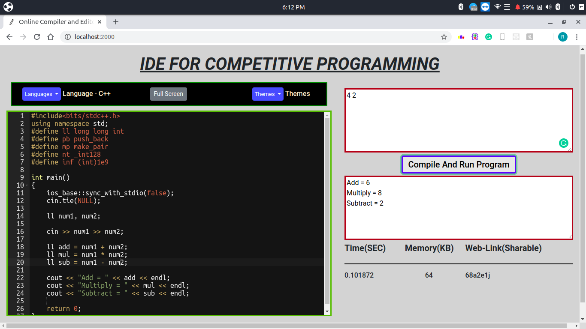
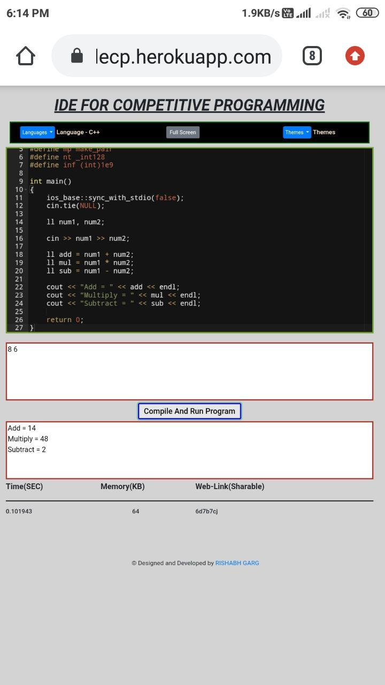

# CodeBox ONLINE IDE :clipboard:
This online IDE is based on JavaScript/NodeJS which supports C++/JAVA/Python language using online compiler. It supports more than 10 Themes, predefined syntax of codes using Java-script and Real-time compilation using Ajax, Jquery, Socket.io, File Handling & Sub-process Library in JavaScript.

Tools/Technologies: JavaScript, NodeJS, HTML, CSS, Jquery , Javascript , Bootstrap , AJAX, Socket.


## Steps to Run Locally :scroll:
```sh
1. Clone this repository
2. Open the terminal where this repository is downloaded.
3. Make sure you have javascript compiler and npm installed in your system.
4. Now run this command npm install
5. Open the browser with this link http://localhost:2000/
```

## Screenshots :crown:
Desktop View             |  Mobile View
:-------------------------:|:-------------------------:
  |  


## Help Contributing Guides :bangbang:

I love to have different `issues` and `pull request` for the betterment of this project.

Please discuss it with me first, before creating any pull request [new-issue](https://github.com/rishabhgarg25699/CodeBox-ONLINE_IDE/issues/new).

:tada: :confetti_ball: :smiley: _**Happy Contributing**_ :smiley: :confetti_ball: :tada:

## Features to be added :arrow_up:
- Live Editing in the text editor in which more that one person can edit the code at the same time.
- Submissions Page - Last Compile And Run Code will be present in the site
- Login And Logout - Site secured by Login and Logout authentication using Passport.js

## Contact With Me :busts_in_silhouette:

- Telegram - https://t.me/Rishabhhello
- Gitter - https://gitter.im/rishabhgarg25699

